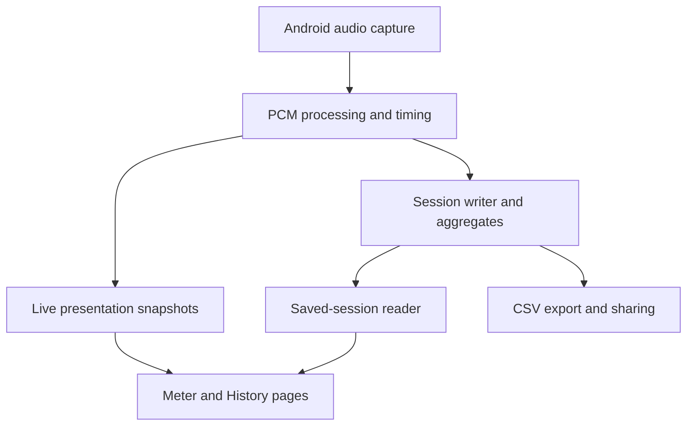
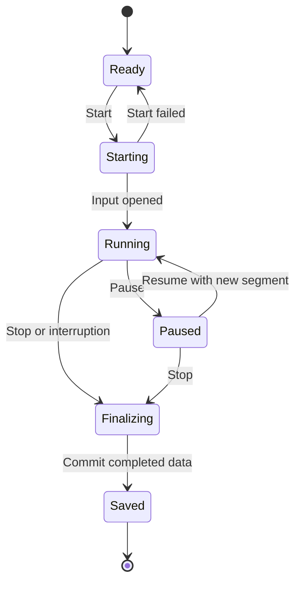

# Cuicatl — development plan and technical report

Date: 2026-10-08 (America/Sao_Paulo). Planning revision: 1.

Repository: <https://github.com/dante-souza/Cuicatl>.

Status: initial development baseline. This document specifies intended behavior and acceptance gates; it does not claim that the application, measurements, tests, or releases already exist. Implementation choices marked **proposed** remain subject to device evidence and design review.

## 1. Product intent and established requirements

Cuicatl is the sound-analysis member of the CATL family. It should support field observation, acoustic investigation, and inspection of recorded measurement sessions. Its identity is distinct from Yeyecatl while sharing a family design language.

The central workflow is: start a measurement session, observe the sound through suitable views, stop and preserve the session, reopen it, and export/share enough data to understand the result outside the application.

| Requirement | Planning treatment |
| --- | --- |
| Approved visual identity | Preserve the accepted icon, splash direction, and family assets. Adapt them to Android resources during Phase 0. |
| Session CSV export/share | Mandatory core functionality, implemented with the first end-to-end capture session. |
| Lateral paging | Swipe between analysis pages, with visible selectors for accessibility and direct navigation. |
| Session continuity | Page changes must preserve capture, timing, statistics, and session identity. |
| Portable evidence | Timestamped measurements, measurement conventions, input information, and calibration context accompany exports. |
| Focused sibling applications | Cuicatl owns acoustic analysis. Yeyecatl continues to own Wi-Fi analysis. |
| Repository boundaries | Cuicatl must not accumulate generic scaffolding or multi-agent orchestration responsibilities. |
| Delivery discipline | Feature → dev → main; preserve history, phase snapshots, device evidence, and release artifacts. |

Bosch iNVH and Decibel X are functional references from the product discussion. They are sources of interaction ideas, not specifications to clone or evidence that Cuicatl can achieve their measurement performance.

## 2. Repository baseline and scope

Inspection of `main` at commit `c7452773eac42c1e7fad96211347906a4344ce10` found the AGPL license, a gitignore, and approved branding assets. There was no Android project, root README, CI configuration, or `AGENTS.md`. At inspection, `main` was the only branch.

Existing branding assets include `cuicatl-app-icon.png`, `cuicatl-splash-screen.png`, `catl-family-visual-identity.png`, and the Yeyecatl reference icon. The existing branding README contains older WebP filenames and wording about a future identity board; Phase 0 should reconcile that inventory with the files actually present. The assets themselves remain the visual baseline.

### First public release: proposed v0.1.0

Include microphone readiness, user-started capture, digital input levels, estimated SPL when a suitable calibration profile is present, A/Z frequency weighting, clearly defined current/minimum/maximum/equivalent levels, saved sessions, Meter/History paging, history inspection, CSV export, and Android sharing. Include interruption handling and preservation of completed data.

Do not make the first release depend on FFT, octave analysis, spectrograms, complete audio recording, comparison dashboards, or vibration. Those capabilities have separate validation costs and can follow without weakening session portability.

Vibration remains a candidate for later scope review. It would require accelerometer-specific units, gravity handling, sensor timing, mounting assumptions, and validation; it is not an approved first-release requirement. Sound intensity in physical units is also outside the initial scope: the baseline measures digital input and estimates sound pressure level, not a directional intensity field.

### Product defaults: proposed

- Local processing and app-private storage; no account or network dependency.
- Explicit Start action before microphone capture. Opening the app performs readiness checks, not automatic recording.
- Measurement logging enabled for a running session. Full audio recording is a separate, later, opt-in feature.
- No location collection in the baseline; users can supply a text label or note.
- A user-started measurement service owns active capture; returning to the app reconnects to the same session.
- Saved sessions are immutable measurement records. Editing names or notes must not overwrite the original measurements or calibration snapshot.

## 3. Measurement contract

Measurement definitions must be fixed before implementing a polished meter. Every displayed or exported number needs a unit, reference, time interval, frequency weighting, and validity state.

| Quantity | Intended meaning | Initial availability |
| --- | --- | --- |
| Normalized PCM | Digital audio sample scaled relative to full scale | Transient in Phase 1; complete waveform persistence is later |
| RMS | Root mean square over a defined sample interval | Phase 1, stored with the interval and sample count |
| RMS level in dBFS | RMS relative to digital full scale using the documented convention | Phase 1 |
| Sample peak in dBFS | Maximum absolute digital sample in an interval | Phase 1; distinct from sound-meter maximum level |
| Estimated SPL | Level derived using a matching calibration profile | Phase 2; visibly marked as an estimate |
| A weighting | Frequency filter applied before energy aggregation | Phase 2, numerically validated |
| Z weighting | Nominally flat frequency weighting in the analysis pipeline | Phase 2; does not imply a flat physical microphone response |
| Current level | Latest completed measurement interval | Phase 1 digital; Phase 2 estimated SPL |
| Minimum/maximum | Extrema of valid interval levels under one fixed convention | Phase 2 |
| Leq | Energy-equivalent level over valid captured time | Phase 2, with weighting and duration shown |
| Fast/Slow response | Exponentially time-weighted level, if explicitly implemented | Separate Phase 2 subtask; generic UI smoothing must not use these labels |

### Proposed digital definitions

For normalized samples `x[n]`, define interval mean-square `E = sum(x[n]^2) / N`, RMS `sqrt(E)`, and RMS level `10 * log10(E)` dBFS. Under this convention, a full-scale sinusoid has an RMS level near −3.01 dBFS; a sample peak at full scale is 0 dBFS. Document PCM conversion, endpoint asymmetry, accumulation precision, and zero handling in the implementation specification.

Exact digital zero has no finite logarithmic level. Preserve zero energy with an explicit state and an empty logarithmic value in CSV. A visual floor may keep a chart readable, but that floor is not an observed measurement. Treat absent capture data as missing, never as silence.

For calibrated interval levels `L_i` covering valid durations `t_i`, aggregate energy as:

`Leq = 10 * log10(sum(t_i * 10^(L_i / 10)) / sum(t_i))`.

Do not average decibel values arithmetically. Equal-duration intervals at 60 and 80 dB should produce approximately 77.03 dB, not 70 dB. Prefer accumulating sample energy rather than rounded display values. Apply the selected frequency filter before calculating energy. Invalid intervals and pauses contribute neither fabricated energy nor captured duration; report coverage alongside the resulting level.

### Calibration and uncertainty

A single-point profile provides a sensitivity correction: reference SPL minus measured digital level under the same calibration conditions. It cannot establish frequency response, usable dynamic range, or accuracy across every acoustic condition. External calibrated microphones improved agreement in the NIOSH follow-up study [S6]; those findings are not accuracy claims for Cuicatl or the J8.

Each profile should contain an immutable ID/version, device and input identity, capture source, sample format/rate, reference method and level, relevant weighting, correction, creation time, and notes. Bind a profile to the applicable capture configuration. A changed input invalidates automatic reuse until compatibility is established.

Use descriptive states: **Uncalibrated**, **Reference-adjusted estimate**, and **Profile mismatch**. Do not display a certified-instrument badge or infer an accuracy class from entering an offset. NIOSH's published app specifications describe its own tested system [S5], not Android applications generally.

Session records retain a snapshot of the profile and analysis configuration. Editing a profile later must not silently recalculate old results. Future reanalysis creates a separate derived result with its own provenance.

## 4. Capture architecture and timing

Use Kotlin and Compose as the proposed implementation stack. Use `AudioRecord` for access to PCM buffers [S1]. Prefer a single app module with clear internal package boundaries initially; create additional Gradle modules only when they solve an observed boundary or build problem.

| Responsibility | Proposed boundary | Ownership rule |
| --- | --- | --- |
| Capture readiness | Permissions and platform/input capability provider | Produces explicit readiness reasons, not UI-only booleans |
| Audio acquisition | Android adapter around AudioRecord | Owns input resources and read errors |
| Signal analysis | Pure Kotlin numerical components where practical | Independent of Compose and Android lifecycle |
| Session lifecycle | Session controller owned by measurement service | Exactly one active session; idempotent start/stop commands |
| Persistence | Session repository and append writer | Durable measurement records; UI is not the data store |
| Presentation | ViewModel and Compose pages | Observes snapshots and submits user intents |
| Export | Versioned export serializer and Android sharing adapter | Reads a consistent saved snapshot |

### Proposed capture negotiation

Begin by testing mono PCM16 at 48 kHz on the J8, with a documented 44.1 kHz fallback if initialization fails. Record the actual configured rate, format, route, source, and buffer size. A successful requested setting does not establish the physical microphone's bandwidth.

Check support for `UNPROCESSED`; use a documented fallback such as `VOICE_RECOGNITION` when needed. Android documents that unsupported unprocessed input does not guarantee an unprocessed signal [S2]. Preserve reported support and processing uncertainty in metadata. Probe available processing effects and document their state when observable, without claiming the entire vendor path has been verified.

Read buffers on a dedicated worker. Do not allocate a complete session waveform in memory. The durable writer must not silently lose frames when busy: apply a documented backpressure policy, preserve any detected loss event, and terminate capture with a clear reason when reliable logging cannot continue. Presentation can skip intermediate snapshots; measurement storage cannot treat UI refresh as its input stream.

### Three distinct rates

| Rate | Proposed starting point | Meaning |
| --- | --- | --- |
| Audio sampling | Negotiated, initially 48 kHz | Digital audio samples per second |
| Persisted measurement interval | 100 ms | One energy/peak record for each completed interval |
| Numerical display refresh | About 5 updates per second | Latest presentation snapshot; tune using J8 readability and load |

These are starting parameters, not promised device capabilities. Partial final intervals retain their actual sample count and duration. Analysis results must remain unchanged by UI refresh rate. Graph decimation may reduce drawing cost while storage retains every measurement frame.

### Timestamp policy

Use one consistent monotonic timebase for duration and segment timing. Prefer a boot-time basis aligned with Android capture timestamps when supported; record fallback timing and its quality. Store an independent UTC session anchor and the original timezone offset for external interpretation. Derive each frame's capture interval from sample positions and capture-time anchors, not from the moment Compose receives it.

Store observed wall-clock adjustment events rather than rewriting earlier timestamps. Sequence numbers identify ordering; interval start/end and sample count identify coverage. Distinguish wall-clock elapsed time, valid captured duration, gaps, and paused time. After process death, close the recovered record as interrupted; do not imply that capture continued.

## 5. Session lifecycle and durability

Pause/resume is an explicit Phase 3 addition; Phase 1 can implement Start/Stop first. The persisted model supports segments and gaps from the beginning. A saved session also has an outcome such as `completed`, `interrupted`, or `recovered`; an interruption is not disguised as successful completion.

| Trigger | Required behavior |
| --- | --- |
| Permission denied | Explain the readiness reason; create no running session |
| Double Start | Keep one capture owner and one session |
| Page change or recomposition | Preserve capture and session ID |
| Rotation/recreation | Rebind to the existing service session |
| Stop | End capture, flush complete records, finalize metadata, then expose export |
| Pause/resume | Record a gap; resume as a new segment with timing and configuration |
| Input route change | Record the event and stop/finalize in v0.1.0; later seamless continuation requires a new validated segment |
| Permission loss, capture failure, or input silencing | Mark the condition and preserve available data; do not draw a fresh normal measurement |
| Storage failure | Stop capture, keep the readable persisted prefix, report incomplete outcome |
| Process death | Recover completed transactions and label interruption on next launch |
| New session | Allocate a new ID and new aggregates; never reset an existing saved record |

A proposed Room/SQLite repository can store session metadata, segments, measurement frames, and events with bounded batched transactions. Phase 0 must document the checkpoint interval, estimated rows/hour, and recoverable tail-loss bound. App-private storage is the authoritative session source; exported CSV is a portable copy.

A user-started microphone foreground service is proposed for screen-off capture and app switching. Modern Android requires the appropriate microphone service declaration and permissions, and imposes while-in-use restrictions on starting it [S3]. Start from the visible app after permission approval; expose a persistent notification with Stop and session status. Exact declarations and behavior must be reviewed against the SDK selected in Phase 0.

Do not promise indefinite capture across system termination. Define and test preservation, notification behavior, return-to-session behavior, and screen-off timing. If a wake lock is necessary, scope it to active measurement and justify it using device results.

## 6. CSV export and sharing contract

Export is implemented in Phase 1 and evolves with a schema version. It must work without complete audio recordings or a network connection. CSV contains recorded measurement frames and derived quantities; it does not by itself preserve a sample-by-sample waveform for later FFT reanalysis.

### Proposed portable bundle

Offer **Share measurement CSV** for direct access to the principal table and **Export full session** for a ZIP containing:

| File | Content |
| --- | --- |
| `session.csv` | One row with session identity, device/app version, time anchors, outcome, durations, profile snapshot, and summary conventions |
| `segments.csv` | One row per capture segment with input identity, actual rate/format, source/processing state, timing quality, and analysis configuration |
| `measurements.csv` | One row per measurement interval with raw digital energy/RMS/peak, derived levels, timing, and validity |
| `events.csv` | Interruptions, pauses, route/configuration changes, notes, and their timing |
| `README.txt` | Schema version, field definitions, units, null handling, and interpretation limits |
| `SHA256SUMS` | Integrity checksums for the exported payload files |

Repeat essential context in the principal measurement table so a directly shared CSV remains interpretable: schema version, session and segment IDs, timing, sample rate, weighting, calibration profile/version, correction, and validity. The full bundle preserves richer provenance.

### Measurement fields: proposed schema 1

| Field | Unit/type | Rule |
| --- | --- | --- |
| `schema_version` | Integer | `1` for the initial schema |
| `session_id`, `segment_id` | Opaque IDs | Join to session/segment tables; no device serial number |
| `sequence` | Integer | Unique increasing measurement-frame index within the session |
| `interval_start_utc` | ISO 8601 UTC | Capture-time estimate; timing quality is recorded |
| `elapsed_start_ms`, `duration_ms` | Milliseconds | Monotonic elapsed start and actual captured interval duration |
| `sample_rate_hz`, `sample_count` | Integers | Configured stream rate and samples represented |
| `mean_square_fs`, `rms_fs`, `sample_peak_fs` | Full-scale normalized values | Pre-weighting digital measurements; finite values only |
| `rms_dbfs`, `sample_peak_dbfs` | dBFS | Empty for exact zero; explicit signal state distinguishes it from missing data |
| `frequency_weighting` | Enum | `NONE` in Phase 1; `A` or `Z` when implemented |
| `calibration_profile_id`, `calibration_profile_version` | ID/integer | Empty when no compatible profile is applied |
| `calibration_offset_db` | dB | Empty when uncalibrated; never silently assume a universal offset |
| `interval_level_db_spl_est` | Estimated dB SPL | Empty until a compatible calibration and valid interval exist |
| `cumulative_leq_db_spl_est` | Estimated dB SPL | Valid captured energy only, under the segment's fixed convention |
| `clipped_sample_count` | Integer | Defined digital rail/threshold detector; does not detect every analogue distortion |
| `signal_state` | Enum | `nonzero`, `digital_zero`, `missing`, or `invalid` |
| `quality_flags` | Delimited codes | Known clipping, timing fallback, processing uncertainty, or other recorded quality states |

Keep analysis settings fixed during an active segment. For v0.1.0, changing weighting or calibration is allowed while stopped or paused and opens a new segment on resume. Cumulative Leq resets at a new segment; the session summary combines only segments with equivalent conventions and otherwise reports separate results. A current display toggle must not mutate recorded history.

### Serialization rules

- UTF-8, comma delimiter, decimal point, header row, and consistent line endings. Escape commas, quotes, and newlines in text fields.
- Empty fields represent unavailable values; zero remains numeric zero. Do not serialize `NaN` or infinity as ordinary measurements.
- Numeric precision preserves analysis usefulness independently of displayed rounding.
- Export arbitrary user text safely for spreadsheet opening; document any reversible text escaping convention.
- All tables share a schema version. Breaking field meanings or units require a new version and compatibility documentation.
- Finalize the selected session snapshot before export. Repeated exports of an unchanged record should produce equivalent table content.
- Use Android content URIs and temporary read permissions for sharing [S4]. Support explicit save through the system document picker; do not request broad filesystem access for convenience.
- Cancelled sharing or saving leaves the original session intact. Export failure can be retried.

Acceptance requires opening exports in Excel and an independent CSV reader, checking timestamps and quoting, verifying row counts and joins, and recalculating representative aggregates outside the app. Spreadsheet locale behavior should be tested on the user's Windows environment; the canonical format remains locale independent.

## 7. Interaction and screen layout

The initial analyzer has two pages: **Meter** and **History**. Add **Spectrum**, **Octave**, and **Spectrogram** only when those capabilities are implemented. Saved sessions, calibration, and settings are utility destinations rather than empty analyzer pages.

| Screen area | Intended content |
| --- | --- |
| Header | Session label, input identity, calibration/estimate state |
| Visible page selectors | Meter / History; direct access and current-page indication |
| Main page | Meter values or time history, with explicit units and analysis conventions |
| Fixed session controls | Start/Stop, elapsed and captured duration, later Pause/Resume |
| Session actions | Save status, saved-session navigation, export/share |

Use stable dimensions, consistent typography, sufficient text size, accessible descriptions, and readable dark/light themes. Permission explanations and capture errors use predictable regions so changing status does not repeatedly shift the graph. Do not draw a measured value before the first valid interval.

History supports live-follow mode, a cursor, and inspection of a saved session. When a user navigates backward during capture, leave follow mode and show a clear **Return to live** action. Gaps are visible discontinuities. A stale view must not keep animating as though new audio arrived.

Horizontal gestures need an explicit ownership rule: dragging inside an interactive graph navigates its time range; swiping in a dedicated page-navigation area changes analyzer pages. Visible selectors provide a reliable alternative. Validate this on the J8 before adding more pages. Preserve zoom/range/cursor state per page and avoid automatic scrolling unrelated to an explicit follow setting.

The design should work on a small display with increased system font size. A graph export image is a later convenience and cannot replace CSV or calibration context.

## 8. Phased delivery and acceptance gates

Each phase should leave a runnable, evidence-backed state once application code begins. Subphases may be used to keep reviews and device testing manageable. Completion requires the listed gate, not merely an implemented screen.

### Phase 0 — Foundation and contracts

Deliver an Android project, branded launcher/splash, Meter/History shell, toolchain records, Gradle wrapper, build/lint/test CI, session and readiness models, export schema, and documented measurement conventions. Reconcile branding references with actual assets and convert the accepted directions into adaptive icon and platform splash resources.

Proposed initial compatibility is minSdk 26, retaining J8 Android 10 support. Select compile/target SDK, AGP, Kotlin, Compose, Gradle, and JDK versions as a tested compatible set during bootstrap; do not copy an older application's versions without checking compatibility. Confirm the application ID and declare original code's intended `AGPL-3.0-or-later` licensing metadata before the first app release.

Gate: clean CI build/lint/tests; a branded debug APK opens on the J8; no microphone starts on launch; contracts and build instructions are committed. The shell does not imply unavailable analysis capabilities.

### Phase 1 — Capture, durability, and export

Suggested increments: **1A** readiness and PCM probe; **1B** Start/Stop, timing, digital measurements, and service ownership; **1C** durable sessions, recovery, CSV/save/share.

Deliver actual input diagnostics, current RMS/sample peak in dBFS, elapsed/captured durations, stored measurement intervals, session list/detail, interruption outcomes, and schema-1 export. Provide a visible uncalibrated state. Complete export before advanced SPL or chart work.

Gate: capture a labeled session on the J8, stop, reopen, export, and independently inspect it. Test permission denial, repeated Start/Stop, rotation, page changes, process death, screen-off capture, and storage failure. Record the tested durability loss bound and actual capture configuration. No fake SPL is used to fill the meter.

### Phase 2 — Meter, calibration, and weighted analysis

Suggested increments: **2A** numerical pipeline and A/Z filters; **2B** calibration profile workflow; **2C** current/minimum/maximum/Leq presentation and matching export fields. Fast/Slow response is included only with documented numerical behavior and tests; otherwise use interval-level wording.

Gate: synthetic signals establish RMS/peak behavior, energy aggregation, filter response, partial-interval treatment, and calibration arithmetic. An input/profile mismatch is visible and disables inappropriate calibrated values. Exports preserve the profile snapshot. Any physical accuracy claim requires separate reference-instrument evidence.

### Phase 3 — History, paging, and first release

Deliver live and saved histories, Meter/History paging, persistent controls, cursor/range navigation, Return to live, explicit pause/resume segments, labels/notes, and usable export actions. Complete lifecycle and accessibility polish rather than adding more analysis types.

Gate: swipe repeatedly during capture without changing the session or losing stored intervals; inspect older data while new data is captured; verify graph values against stored/exported frames; observe pauses and input interruptions as gaps; reopen and share a saved session.

Proposed release gate: a 60-minute J8 soak run, including screen-off and return-to-app checks, with bounded memory, measured storage growth, usable stop/export, and no unexplained gaps. Record temperature/battery observations and timing behavior. This is a validation target, not a pre-existing performance result.

After these gates, release **v0.1.0** with APK, checksums, release notes, original device evidence, and the precise measurement limitations observed. An internal Phase 1/2 APK is a testing milestone rather than the complete public baseline.

### Phase 4 — FFT spectrum

Deliver a live spectrum, frequency cursor, peak hold, explicit FFT length/window/overlap, amplitude reference, averaging, and spectrum export. Distinguish a spectrum snapshot from a complete time-frequency recording. Record configuration alongside each exported result.

Gate: known digital tones validate bin positions, window/amplitude normalization, leakage, frequency resolution, and peak hold. At sample rate `Fs` and FFT length `N`, bin spacing is `Fs/N`; do not present bin spacing as the full ability to resolve nearby tones. Profile J8 CPU/memory cost before selecting defaults. Physical tones provide supplementary device evidence, not the sole numerical test.

### Phase 5 — Extended analysis

Split into independent increments: spectrogram, octave bands, optional complete audio recording/replay, session comparison, and plot-image export. Full audio introduces storage budgeting, replay metadata, privacy controls, and explicit retention/deletion behavior. Saved waveform navigation and later FFT reanalysis depend on waveform availability; measurement CSV alone is insufficient.

Gate each capability separately. Review vibration and external-microphone workflows as new scope decisions rather than expanding this phase without bounds.

## 9. Validation strategy

| Layer | Meaningful checks | Evidence |
| --- | --- | --- |
| Pure numerical tests | Zero, DC input behavior, sine RMS, amplitude changes, mixed energies, A/Z response, calibration, partial frames | Deterministic fixtures and documented tolerances |
| Session tests | Lifecycle transitions, idempotent commands, segments/gaps, interrupted recovery, profile snapshots | State and persistence tests |
| Export tests | Quoting/nulls, precision, field/version contracts, row counts, aggregate reconstruction | Golden fixture plus independent parser/recalculation |
| UI/instrumentation | Paging continuity, rotation, controls, long text/font size, saved/live distinction | Targeted tests and original screenshots |
| J8 hardware checks | Actual input/source/rate, screen-off behavior, interruptions, clipping indicators, sustained capture | Device log, metadata, screenshots, test checklist |
| Physical comparison | Comparable measurement geometry and reference/calibration context | Explicitly recorded setup; claim only what the evidence supports |
| CI | Build, lint, numerical/session/export tests; instrumentation only where configured | Workflow status tied to exact commit |

The Samsung Galaxy J8 (SM-J810M, Android 10, API 29, 32-bit ARM) is the initial lab device. Moto G41 and Redmi 10A remain unchanged under the standing lab policy. Later Android-version coverage requires separately authorized device use or suitable emulator checks; J8 evidence alone cannot establish all modern background-service behavior.

Reconcile stored sample counts, interval durations, and events before treating a displayed frame count as proof of capture continuity. Flag suspicious zeros against input state and timing rather than drawing conclusions from zero alone.

Freeze original screenshots at their original dimensions. Label synthetic, emulator, and physical-device evidence separately. Record commit SHA, APK SHA256, device/OS, capture configuration, test duration, and known failures with each phase snapshot.

## 10. Risks, effort, and decision gates

| Risk | Relative uncertainty | Control or decision gate |
| --- | --- | --- |
| Vendor microphone processing or unknown frequency response | High | Probe actual J8 path; export uncertainty; separate digital correctness from acoustic accuracy |
| Lifecycle/background restrictions | High | Single service owner; version-aware declarations; screen-off and return tests |
| Calibration reused for a changed input | High impact | Configuration-bound profiles and immutable session snapshots |
| Lost data during UI load, storage failure, or process death | High impact | Bounded pipeline, persisted checkpoints, explicit gaps/outcomes, recovery tests |
| Gesture conflict between paging and graph navigation | Medium | Defined gesture areas, visible page selectors, J8 usability gate |
| Battery, CPU, heat, and growing history | Medium initially; higher with FFT/audio | Bounded memory, indexed/paged storage, display decimation, soak profiling |
| CSV looks complete but lacks interpretation context | High impact | Versioned schema, direct-file context, full-session bundle, external reconstruction |
| Scope growth into vibration, compliance, or general scaffolding | High schedule risk | First-release boundary and separate scope review |

Effort is best assessed by acceptance-gated increments rather than a calendar promise. Phase 0 is smaller than capture/lifecycle work; Phases 1 and 2 contain the largest first-release uncertainty. Phase 3 depends on their stability. FFT and spectrogram substantially increase analysis and performance validation. After the Phase 1 probe, record actual implementation/test effort and revise the remaining estimate.

The current critical path is: **capture/timing probe → durable session and export → validated meter/calibration → navigable history → release validation**. If the J8's input path is unsuitable for useful SPL estimation, keep the digital analyzer useful and investigate an external input before making stronger measurement claims.

## 11. Repository workflow, archaeology, and release policy

Create `dev` from the inspected baseline and use `feature/phase-0-planning` for this document. Integrate the completed planning change into `dev` with a merge commit, then promote the documentation baseline into `main` after its documentation checks pass. This completes the planning milestone, not the implementation gate for Phase 0. Subsequent implementation phases use descriptive `feature/phase-*` branches. Promote validated development to `main` when its milestone is ready; never squash published phase history. Hotfixes follow the established main-first exception and are propagated to active branches.

Suggested product-specific paths:

| Path | Purpose |
| --- | --- |
| `docs/planning/` | Product plan, roadmap revisions, scope and contract decisions |
| `docs/architecture/` | Implementation diagrams and decisions once made |
| `docs/validation/phase-*/` | Checklists, environment records, findings, original evidence references |
| `docs/assets/branding/` | Accepted visual assets and provenance |
| `app/` | Android application after Phase 0 bootstrap |

Keep large binary artifacts in appropriate release attachments when warranted, with checksums and traceable links. Define phase tags when freezing a completed phase; do not create a release tag before its gate passes. A phase record should explain what changed, what passed, what remains uncertain, and what the next phase can rely on.

Proposed development commands after bootstrap: `make check`, `make build-debug`, `make install-j8`, and `make open-j8`. Device commands must verify the expected J8 identity instead of selecting an arbitrary connected phone. On Windows, document the actual supported Make/shell environment or provide narrowly scoped PowerShell entry points. These commands are planned, not available in the current branding repository.

CI performs product build/lint/tests. Device installation runs locally against the J8. Add only scripts needed for Cuicatl delivery; reusable environment frameworks belong outside this repository. Review numerical or FFT dependency licensing before adoption and preserve notices. Declare original code's intended `AGPL-3.0-or-later` scope clearly during bootstrap; the existing AGPL license text alone does not state an application's later-version grant.

## 12. Immediate Phase 0 backlog

| Order | Work item | Completion evidence |
| --- | --- | --- |
| 1 | Confirm application ID, supported API range, compatible toolchain, original-code license declaration | Recorded bootstrap decisions |
| 2 | Reconcile branding inventory and implement Android icon/splash resources | Resources plus J8 launch screenshot |
| 3 | Freeze measurement terminology, timebase, segment rules, and schema-1 export contract | Reviewed specifications and small sample fixtures |
| 4 | Bootstrap Kotlin/Compose project, Gradle wrapper, and narrow developer commands | Reproducible local build |
| 5 | Add CI build/lint/tests and pure numerical test entry points | Passing workflow on exact commit |
| 6 | Implement readiness/session shell and Meter/History layout | No automatic microphone capture; stable controls |
| 7 | Create J8 probe checklist for Phase 1 | Source/rate/route/processing/timing/storage scenarios |
| 8 | Freeze Phase 0 evidence and record remaining decisions | Phase gate checklist and archaeology record |

Open decisions to resolve during implementation: exact application ID; compatible toolchain versions; persistence batching/loss bound; J8 capture defaults; timing fallback behavior; graph library versus Compose drawing; supported calibration reference workflow; and modern-Android validation environment. These should be resolved with evidence at the relevant gate, not left as hidden assumptions.

## 13. Sources and applicability

Technical references were checked on 2026-10-08. They support platform constraints and measurement context; architecture, phases, defaults, schema, and acceptance gates above are Cuicatl planning decisions. Recheck changing Android requirements when selecting the SDK and before release.

- **[S1] Android Developers — AudioRecord:** <https://developer.android.com/reference/android/media/AudioRecord>. PCM access, stream configuration, routing, read errors, and capture timestamps.
- **[S2] Android Developers — MediaRecorder overview:** <https://developer.android.com/media/platform/mediarecorder>. Audio-source processing and unprocessed-input support/fallback considerations; Cuicatl's proposed acquisition API remains AudioRecord.
- **[S3] Android Developers — Foreground service types:** <https://developer.android.com/develop/background-work/services/fgs/service-types#microphone>. Microphone service type and start/permission restrictions.
- **[S4] Android Developers — Sharing a file:** <https://developer.android.com/training/secure-file-sharing/share-file>. Content URI sharing and temporary permissions.
- **[S5] CDC/NIOSH — Sound Level Meter App:** <https://www.cdc.gov/niosh/noise/about/app.html>. The NIOSH application's scope, tested-system claims, and Android variability context.
- **[S6] Kardous and Shaw (2016) — Evaluation of smartphone sound measurement applications using external microphones, a follow-up study:** <https://stacks.cdc.gov/view/cdc/203482>. External calibrated-microphone evaluation; not a Cuicatl accuracy validation.
- **[S7] CDC/NIOSH — Sound Level Meter application guide:** <https://www.cdc.gov/niosh/media/pdfs/NIOSH-Sound-Level-Meter-Application-app-English.pdf>. Measurement terminology, calibration workflow, and session information as functional references.

## 14. Planning revision policy

Update this plan when evidence changes a decision, a phase is split, or scope is accepted. Preserve dated rationale and distinguish completed work from future proposals. Before each phase starts, turn its acceptance gate into a concrete implementation checklist; after completion, link the exact evidence and tagged state. This report establishes the initial plan and does not authorize claims of certified accuracy or imply that later candidate capabilities are already committed.
