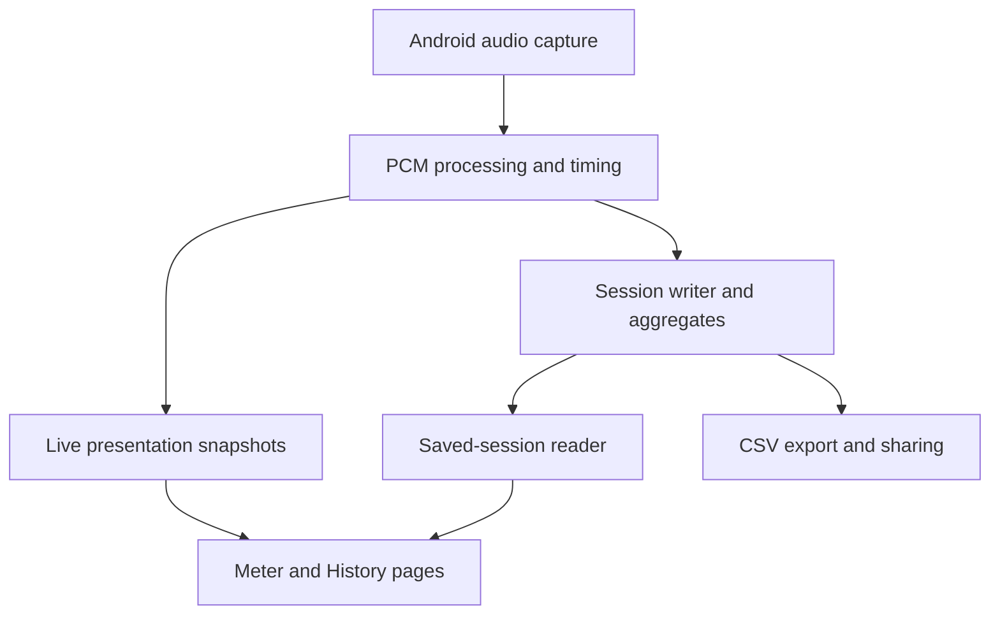

# Cuicatl — development plan and technical report

Date: 2026-10-08 (America/Sao_Paulo). Planning revision: 2.

Repository: <https://github.com/dante-souza/Cuicatl>.

Status: reviewed planning baseline with a revised execution order. The author reassessment and supplied independent review have been reconciled in the [review-disposition record](cuicatl-planning-review-disposition-2026-10-08.md). This document specifies intended behavior and acceptance gates; it does not claim that capture, calibration, tests, or release gates have passed. Implementation choices marked **proposed** remain subject to device evidence and design review.

Revision 1 remains available in [Git history at the published planning baseline](https://github.com/dante-souza/Cuicatl/blob/7a96706f2114f411bfc5f59fcaff57733557da2d/docs/planning/cuicatl-development-plan-2026-10-08.md). Revision 2 changes scope and sequencing without marking application milestones complete.

## 1. Product intent and established requirements

Cuicatl is the sound-analysis member of the CATL family. Its identity is distinct from Yeyecatl while sharing a family design language.

Proposed first-use-case statement: Cuicatl initially serves hands-on Android users who want to capture an acoustic event, inspect changes over time, and share timestamped results with their input and calibration context. Dante is the first intended validation user, with existing iNVH experience and an explicit need for portable sessions. The specific acoustic task and setting remain to be chosen before a useful-session acceptance test; this is a use-case hypothesis, not evidence of wider demand or a claim that another application lacks these capabilities.

First practical acceptance scenario: capture a labeled event on the J8, inspect its level history, stop and reopen it, share the measurement CSV, and interpret the result outside the application. The workflow should demonstrate useful observation even while SPL estimation is still being evaluated.

The central workflow is: start a measurement session, observe the sound through suitable views, stop and preserve the session, reopen it, and export/share enough data to understand the result outside the application.

| Requirement | Planning treatment |
| --- | --- |
| Approved visual identity | Preserve the accepted icon, splash direction, and family assets. Adapt them to Android resources during the minimum foundation work. |
| Session CSV export/share | Mandatory core functionality, implemented with the first end-to-end capture session. |
| Lateral paging | Swipe between analysis pages, with visible selectors for accessibility and direct navigation. |
| Session continuity | Page changes must preserve capture, timing, statistics, and session identity. |
| Portable evidence | Timestamped measurements, measurement conventions, input information, and calibration context accompany exports. |
| Focused sibling applications | Cuicatl owns acoustic analysis. Yeyecatl continues to own Wi-Fi analysis. |
| Repository boundaries | Cuicatl must not accumulate generic scaffolding or multi-agent orchestration responsibilities. |
| Delivery discipline | Feature → dev → main; preserve history, phase snapshots, device evidence, and release artifacts. |

Bosch iNVH and Decibel X are functional references from the product discussion. They are sources of interaction ideas, not specifications to clone or evidence that Cuicatl can achieve their measurement performance.

## 2. Repository baseline and scope

Inspection of `main` at commit `c7452773eac42c1e7fad96211347906a4344ce10` found the AGPL license, a gitignore, and approved branding assets. There was no Android project, root README, CI configuration, or `AGENTS.md`. At inspection, `main` was the only branch.

The historical inspection above describes the original baseline. At the Revision 2 check, Android foundation work had started on `feature/phase-0-foundation-contracts`; it had not been promoted to `main`. The existing bootstrap remains useful and is not restarted by this revision.

Existing branding assets include `cuicatl-app-icon.png`, `cuicatl-splash-screen.png`, `catl-family-visual-identity.png`, and the Yeyecatl reference icon. The existing branding README contains older WebP filenames and wording about a future identity board; Phase 0 should reconcile that inventory with the files actually present. The assets themselves remain the visual baseline.

### First public release: proposed v0.1.0

Include microphone readiness, user-started Start/Stop capture, digital input levels, a fixed input/analysis configuration per session, saved sessions, Meter/History paging, basic history inspection, a directly shareable measurement CSV, and Android sharing. Preserve available data and the session outcome when capture is interrupted.

The intended sound-meter capability includes A/Z analysis, clearly defined current/minimum/maximum/equivalent levels, and estimated SPL when a suitable reference adjustment is available. Decide the reference procedure and its evidence requirements before implementing estimated SPL. After the probe and reference-workflow review, record whether these features can responsibly form part of v0.1.0. An earlier digital-only test APK is a useful development milestone, not an implied calibrated meter.

Use one active calibration configuration initially and preserve its snapshot in each applicable session. Pause/resume, multiple capture segments, calibration-profile collections, and the rich export bundle are later capabilities.

Run a bounded basic FFT experiment earlier if it helps the first acoustic task. Include it in v0.1.0 only when usefulness, numerical checks, and J8 cost justify it; an early experiment does not make the complete Phase 4 spectrum feature set mandatory. Octave analysis, spectrograms, complete audio recording, comparison dashboards, and vibration remain later scope.

Vibration remains a candidate for later scope review. It would require accelerometer-specific units, gravity handling, sensor timing, mounting assumptions, and validation; it is not an approved first-release requirement. Sound intensity in physical units is also outside the initial scope: the baseline measures digital input and estimates sound pressure level, not a directional intensity field.

### Product defaults: proposed

- Local processing and app-private storage; no account or network dependency.
- Explicit Start action before microphone capture. Opening the app performs readiness checks, not automatic recording.
- Measurement logging enabled for a running session. Full audio recording is a separate, later, opt-in feature.
- No location collection in the baseline; users can supply a text label or note.
- A user-started measurement service owns active capture; returning to the app reconnects to the same session.
- Saved sessions are immutable measurement records. Editing names or notes must not overwrite the original measurements or calibration snapshot.

## 3. Measurement contract

Measurement definitions must be fixed before implementing a polished meter. Every displayed or exported number needs a unit, reference, time interval, frequency weighting, and validity state.

| Quantity | Intended meaning | Initial availability |
| --- | --- | --- |
| Normalized PCM | Digital audio sample scaled relative to full scale | Transient in Phase 1; complete waveform persistence is later |
| RMS | Root mean square over a defined sample interval | Phase 1, stored with the interval and sample count |
| RMS level in dBFS | RMS relative to digital full scale using the documented convention | Phase 1 |
| Sample peak in dBFS | Maximum absolute digital sample in an interval | Phase 1; distinct from sound-meter maximum level |
| Estimated SPL | Level derived using a matching calibration profile | Phase 2; visibly marked as an estimate |
| A weighting | Frequency filter applied before energy aggregation | Phase 2, numerically validated |
| Z weighting | Nominally flat frequency weighting in the analysis pipeline | Phase 2; does not imply a flat physical microphone response |
| Current level | Latest completed measurement interval | Phase 1 digital; Phase 2 estimated SPL |
| Minimum/maximum | Extrema of valid interval levels under one fixed convention | Phase 2 |
| Leq | Energy-equivalent level over valid captured time | Phase 2, with weighting and duration shown |
| Fast/Slow response | Exponentially time-weighted level, if explicitly implemented | Separate Phase 2 subtask; generic UI smoothing must not use these labels |

### Proposed digital definitions

For normalized samples `x[n]`, define interval mean-square `E = sum(x[n]^2) / N`, RMS `sqrt(E)`, and RMS level `10 * log10(E)` dBFS. Under this convention, a full-scale sinusoid has an RMS level near −3.01 dBFS; a sample peak at full scale is 0 dBFS. Document PCM conversion, endpoint asymmetry, accumulation precision, and zero handling in the implementation specification.

Exact digital zero has no finite logarithmic level. Preserve zero energy with an explicit state and an empty logarithmic value in CSV. A visual floor may keep a chart readable, but that floor is not an observed measurement. Treat absent capture data as missing, never as silence.

For calibrated interval levels `L_i` covering valid durations `t_i`, aggregate energy as:

`Leq = 10 * log10(sum(t_i * 10^(L_i / 10)) / sum(t_i))`.

Do not average decibel values arithmetically. Equal-duration intervals at 60 and 80 dB should produce approximately 77.03 dB, not 70 dB. Prefer accumulating sample energy rather than rounded display values. Apply the selected frequency filter before calculating energy. Invalid intervals and pauses contribute neither fabricated energy nor captured duration; report coverage alongside the resulting level.

### Calibration and uncertainty

A single-point profile provides a sensitivity correction: reference SPL minus measured digital level under the same calibration conditions. It cannot establish frequency response, usable dynamic range, or accuracy across every acoustic condition. External calibrated microphones improved agreement in the NIOSH follow-up study [S6]; those findings are not accuracy claims for Cuicatl or the J8.

The initial reference-adjustment configuration should contain an immutable ID/version, device and input identity, capture source, sample format/rate, reference method and level, relevant weighting, correction, creation time, and notes. One active configuration is sufficient initially; managing a collection of profiles is later work. Bind the adjustment to the applicable capture configuration. A changed input invalidates automatic reuse until compatibility is established.

Before Phase 2 SPL implementation, choose and document the actual reference procedure, available reference equipment, comparison geometry or microphone/calibrator coupling, applicable level/weighting, and before/after checks. A reference-meter comparison and an external microphone with an acoustic calibrator are distinct candidate workflows; neither is assumed to be available. If no suitable reference exists, continue digital observation and record SPL estimation as blocked. External-input scope is decided at this gate rather than universally postponed to Phase 5.

Use descriptive states: **Uncalibrated**, **Reference-adjusted estimate**, and **Profile mismatch**. Do not display a certified-instrument badge or infer an accuracy class from entering an offset. NIOSH's published app specifications describe its own tested system [S5], not Android applications generally.

Session records retain a snapshot of the active adjustment and analysis configuration. Editing the active configuration later must not silently recalculate old results. Future reanalysis creates a separate derived result with its own provenance.

## 4. Capture architecture and timing

Use Kotlin and Compose as the proposed implementation stack. Use `AudioRecord` for access to PCM buffers [S1]. Prefer a single app module with clear internal package boundaries initially; create additional Gradle modules only when they solve an observed boundary or build problem.

| Responsibility | Proposed boundary | Ownership rule |
| --- | --- | --- |
| Capture readiness | Permissions and platform/input capability provider | Produces explicit readiness reasons, not UI-only booleans |
| Audio acquisition | Android adapter around AudioRecord | Owns input resources and read errors |
| Signal analysis | Pure Kotlin numerical components where practical | Independent of Compose and Android lifecycle |
| Session lifecycle | Session controller owned by measurement service | Exactly one active session; idempotent start/stop commands |
| Persistence | Session repository and append writer | Durable measurement records; UI is not the data store |
| Presentation | ViewModel and Compose pages | Observes snapshots and submits user intents |
| Export | Versioned export serializer and Android sharing adapter | Reads a consistent saved snapshot |

### Proposed capture negotiation

Begin by testing mono PCM16 at 48 kHz on the J8, with a documented 44.1 kHz fallback if initialization fails. Record the actual configured rate, format, route, source, and buffer size. A successful requested setting does not establish the physical microphone's bandwidth.

Check support for `UNPROCESSED`; use a documented fallback such as `VOICE_RECOGNITION` when needed. Android documents that unsupported unprocessed input does not guarantee an unprocessed signal [S2]. Preserve reported support and processing uncertainty in metadata. Probe available processing effects and document their state when observable, without claiming the entire vendor path has been verified.

Read buffers on a dedicated worker. Do not allocate a complete session waveform in memory. The durable writer must not silently lose frames when busy: apply a documented backpressure policy, preserve any detected loss event, and terminate capture with a clear reason when reliable logging cannot continue. Presentation can skip intermediate snapshots; measurement storage cannot treat UI refresh as its input stream.

### Three distinct rates

| Rate | Proposed starting point | Meaning |
| --- | --- | --- |
| Audio sampling | Negotiated, initially 48 kHz | Digital audio samples per second |
| Persisted measurement interval | 100 ms | One energy/peak record for each completed interval |
| Numerical display refresh | About 5 updates per second | Latest presentation snapshot; tune using J8 readability and load |

These are starting parameters, not promised device capabilities. Partial final intervals retain their actual sample count and duration. Analysis results must remain unchanged by UI refresh rate. Graph decimation may reduce drawing cost while storage retains every measurement frame.

### Timestamp policy

Use one consistent monotonic timebase for duration and capture timing. Prefer a boot-time basis aligned with Android capture timestamps when supported; record fallback timing and its quality. Store an independent UTC session anchor and the original timezone offset for external interpretation. Derive each frame's capture interval from sample positions and capture-time anchors, not from the moment Compose receives it.

Store observed wall-clock adjustments rather than rewriting earlier timestamps. Sequence numbers identify ordering; interval start/end and sample count identify coverage. Distinguish wall-clock elapsed time, valid captured duration, and detected gaps. Future pause/resume support must also distinguish paused time. After process death, close the recovered record as interrupted; do not imply that capture continued.

## 5. Session lifecycle and durability

The initial lifecycle is Ready → Starting → Running → Finalizing → Saved. A failed Start returns to Ready with a readiness reason. Exactly one controller owns active capture; duplicate commands must not create competing sessions.

v0.1.0 uses Start/Stop and one fixed capture configuration per session. Stop ends the session. Route changes, permission loss, capture failures, or known input silencing end capture and preserve the available record with an explicit outcome. Pause/resume and multi-segment aggregation are later capabilities.

| Trigger | Required behavior |
| --- | --- |
| Permission denied | Explain the readiness reason; create no running session |
| Double Start | Keep one capture owner and one session |
| Page change or recomposition | Preserve capture and session ID |
| Rotation/recreation | Rebind to the existing capture owner |
| Stop | End capture, flush completed records, finalize metadata, then expose export |
| Input route change | Stop/finalize and record the reason; a new measurement uses a new session |
| Permission loss, capture failure, or known input silencing | Preserve available data and mark the interruption; do not display fresh normal measurements |
| Storage failure | Stop capture, preserve the readable prefix where possible, report an incomplete outcome |
| Process death | Recover the readable persisted record and label interruption on next launch |
| Weighting or calibration change | Apply to a new session; preserve the prior configuration snapshot |
| New session | Allocate a new ID and new aggregates; never reset a saved record |

A saved session has an outcome such as `completed`, `interrupted`, or `recovered`. An interrupted record is not presented as successful continuous capture. Detectable lost data remain explicit; incomplete intervals do not become artificial silence.

### Persistence decision

**Phase 1 evidence update — 2026-10-09:** retain the append-oriented app-private session design for the initial release baseline and defer Room/SQLite.

The original Revision 2 plan called for implemented append and Room/SQLite candidates. The append candidate subsequently passed the demonstrated normal-stop, reopen, export, forced-process-recovery, readable-prefix, and measured preservation checks on the J8. In the instrumented recovery run, 446 complete rows were visible immediately before the helper issued force-stop, 449 complete rows were recovered, and 0 complete rows from the measured pre-kill snapshot were lost. No current Phase 1 requirement requires relational querying, in-place editing, cross-session joins, or transactionally coupled record types.

Building a second persistence stack solely to confirm that it is not presently needed would add implementation, migration, and recovery-validation cost without resolving an observed problem. Room/SQLite remains a deferred alternative with explicit reconsideration triggers: indexed multidimensional session queries, relational metadata, frequent partial updates, transactionally coupled records, or measured file-library performance limits.

For the selected file-based design, record framing, buffered-write policy, partial-write recovery, metadata finalization, and interruption consistency are documented in the Phase 1 preservation and storage-decision records. The process-death result is not a zero-loss claim for sudden power removal or arbitrary storage corruption.

App-private storage is the authoritative session source. CSV is the portable representation; the UI never owns the only copy of the measurements.

A future local-first backup/import capability may copy finalized immutable sessions to a user-selected destination through Android's Storage Access Framework / DocumentsProvider ecosystem. That may include local/removable storage or a provider exposed by an installed drive application. The active app-private session remains authoritative; this does not imply bidirectional live sync, a Cuicatl account service, or custom cloud infrastructure.

A user-started microphone foreground service is proposed for screen-off capture and app switching. Modern Android requires the appropriate microphone service declaration and permissions, and imposes while-in-use restrictions on starting it [S3]. Start from the visible app after permission approval; expose a persistent notification with Stop and session status. Review exact declarations against the selected SDK and test modern Android platform behavior explicitly.

Do not promise indefinite capture across system termination. Test preservation, notification behavior, return-to-session behavior, and screen-off timing. If a wake lock is necessary, scope it to active measurement and justify it using device results.

## 6. CSV export and sharing contract

CSV export/share is mandatory in the first usable capture milestone and works without complete audio recordings or a network connection. CSV contains recorded measurement frames and derived quantities; it does not preserve a sample-by-sample waveform for later FFT reanalysis.

### Initial packaging

Deliver a directly shareable, self-contained measurement CSV first. Include essential session/input/configuration context in the table so a recipient can interpret the file without another attachment. Repeated contextual columns are acceptable at the initial data volume. Avoid a custom comment preamble that would prevent ordinary CSV readers from finding the header and rows.

A richer bundle with separate session, segment, event, and measurement tables is later work, introduced when implemented capabilities or actual inspection needs justify it. Runtime bundle checksums are also later work; APK and archaeology artifact checksums remain part of release practice.

### Schema 1 field layout — frozen 2026-10-09

The Phase 1 fixtures were captured, exported, independently inspected, corrected for timing provenance and recovered-session elapsed-time semantics, and revalidated. The resulting row contract is frozen as **CSV Schema 1**. Breaking field changes require a new schema version. Units, null handling, timing provenance, and validity semantics are specified in `docs/architecture/csv-schema-v1.md`.

| Field group | Intended context or quantity | Rule |
| --- | --- | --- |
| Schema/session identity | Schema version, session ID, sequence | Order and identify rows without exposing a device serial number |
| Session context | Label, app version, device model/OS, outcome | Preserve enough context to interpret a directly shared file |
| Timing | UTC anchor, interval UTC estimate, monotonic elapsed start, actual duration, timing quality | Distinguish capture coverage from presentation/update timing |
| Input configuration | Input identity/type, source, sample rate, sample format, sample count, processing support/state | Record actual stream configuration and uncertainty |
| Digital measurements | Mean-square, RMS, sample peak, corresponding dBFS values | Preserve useful precision; distinguish RMS from peak |
| Analysis convention | Frequency weighting, interval definition, processing/analysis version | Keep fixed within an initial session |
| Reference adjustment | Configuration ID/version, method/reference level, correction, creation time | Preserve a snapshot; empty when no applicable adjustment exists |
| Derived values | Estimated interval SPL and equivalent level when available | Empty until reference and numerical prerequisites are met |
| Validity | Digital-zero/missing/invalid state, clipping count, quality flags | Missing is never fabricated as silence |
| Final coverage | Session elapsed/captured durations and interruption reason | Describe completeness of the finalized saved record |

Do not collapse unavailable measurements into zero. Exact digital zero has zero energy and an explicit state; its logarithmic value is empty. Decide the precise field names, repeated metadata, and spreadsheet-safe text convention from the first real export fixture. Store richer reference/setup details locally where needed even if they are not convenient repeated columns.

Keep weighting and reference adjustment fixed while a session runs. Stop before changing configuration, then start a new session. The displayed and exported aggregates use that session's recorded convention. Multi-segment configuration changes and aggregation are deferred.

### Serialization rules

- UTF-8, comma delimiter, decimal point, header row, and consistent line endings. Escape commas, quotes, and newlines in text fields.
- Empty fields represent unavailable values; zero remains numeric zero. Do not serialize `NaN` or infinity as ordinary measurements.
- Preserve numeric precision independently of displayed rounding.
- Export arbitrary user text safely for spreadsheet opening; document any reversible escaping convention.
- Breaking field meanings or units require a new schema version and compatibility documentation after schema 1 is finalized.
- Finalize the selected session snapshot before export. Repeated exports of an unchanged record should produce equivalent table content.
- Use Android content URIs and temporary read permissions for sharing [S4]. Support explicit save through the system document picker; do not request broad filesystem access for convenience.
- Cancelled sharing or saving leaves the original session intact. Export failure can be retried.

Acceptance requires opening exports in Excel and an independent CSV reader, checking timestamps, units, quoting, missing/zero states, and row counts, and recalculating representative aggregates outside the app. Test spreadsheet locale behavior on the user's Windows environment; the canonical format remains locale independent.

A zero-frame session cannot satisfy measurement-export acceptance. Handle failed starts and empty records explicitly instead of inventing a normal measurement row.

## 7. Interaction and screen layout

The initial analyzer has two pages: **Meter** and **History**. Add **Spectrum**, **Octave**, and **Spectrogram** only when those capabilities are implemented. Saved sessions, calibration, and settings are utility destinations rather than empty analyzer pages.

| Screen area | Intended content |
| --- | --- |
| Header | Session label, input identity, calibration/estimate state |
| Visible page selectors | Meter / History; direct access and current-page indication |
| Main page | Meter values or time history, with explicit units and analysis conventions |
| Fixed session controls | Start/Stop, elapsed and captured duration, later Pause/Resume |
| Session actions | Save status, saved-session navigation, export/share |

Use stable dimensions, consistent typography, sufficient text size, accessible descriptions, and readable dark/light themes. Permission explanations and capture errors use predictable regions so changing status does not repeatedly shift the graph. Do not draw a measured value before the first valid interval.

The initial History page provides live-follow and inspection of saved data. A cursor and interactive time-range navigation can follow once basic capture/export works. When interactive backward navigation is implemented, leave follow mode and show a clear **Return to live** action. Gaps are visible discontinuities. A stale view must not keep animating as though new audio arrived.

Keep swipe paging and visible selectors in the initial two-page interface. Defer interactive graph pan/zoom until basic history is useful. When those gestures are added, define ownership explicitly: dragging inside the interactive graph navigates its time range; a dedicated navigation area or visible selectors changes analyzer pages. Validate this on the J8 before adding more pages. Preserve zoom/range/cursor state per page and avoid automatic scrolling unrelated to an explicit follow setting.

The design should work on a small display with increased system font size. A graph export image is a later convenience and cannot replace CSV or calibration context.

## 8. Phased delivery and acceptance gates

Use bounded increments with runnable results once application code begins. Before each substantial phase, apply the two-review gate in Section 14. A phase is complete when its acceptance evidence exists, not when a screen or document is present. Preserve proportionate evidence and published history.

### Phase 0 — Foundation and capture probe

**0A: Minimum runnable foundation.** Retain the existing Android bootstrap. Confirm application ID, supported API range, compatible toolchain, Gradle wrapper, original-code licensing declaration, a simple branded shell, and microphone readiness. Build instructions and narrow developer commands must make the probe reproducible. Add essential CI alongside this work; completing all future contracts or screen polish is not a prerequisite for reading samples.

Proposed initial compatibility is minSdk 26, retaining J8 Android 10 support. Select compile/target SDK, AGP, Kotlin, Compose, Gradle, and JDK versions as a tested compatible set. Declare original code's intended `AGPL-3.0-or-later` metadata before release. Adapt accepted branding to Android resources without redesigning the approved identity.

**0B: J8 PCM capture/timing probe.** Implement a small diagnostic path testing available source/rate combinations, actual routed input, unprocessed support/observable processing, sample counts, timing availability, digital levels, and interruption behavior. It may use temporary diagnostic output before the public CSV layout is finalized. Start capture explicitly; launching the app never starts the microphone automatically.

Time-box the first probe investigation to **1–2 focused development days**, counted as active work rather than a calendar promise. Deliver findings within that budget: proceed with the tested path, investigate a fallback/external input, or document a blocker. A time-box expiry is not a passed measurement gate.

Gate: a runnable diagnostic APK, actual J8 capture data/configuration, numerical/timing observations, identified limitations, and a decision record. Report uncertainty rather than treating advertised capabilities as acoustic validation. Complete remaining foundation work around these findings; keep the export field layout provisional.

### Phase 1 — Usable session, preservation, and export

Deliver Start/Stop with a fixed configuration, current RMS/sample peak in dBFS, elapsed/captured durations, basic level history, saved session list/detail, reopen, CSV export/share, and interruption outcomes. Compare persistence options in a small recovery experiment and select the simplest passing design. Keep one capture owner independent of page changes.

Gate: Dante captures a labeled event on the J8, inspects its history, stops and reopens it, exports/shares a CSV, and interprets it externally. Independently inspect the captured/exported data and finalize schema 1 at this milestone.

Test permission denial, repeated Start/Stop, rotation, page changes, input change, process death, and storage failure. Screen-off behavior is tested wherever the service path is implemented; broader Android claims require modern platform checks. Document the chosen preservation bound and actual input configuration. Do not populate the meter with invented SPL.

An early bounded FFT experiment may run after basic capture if it helps the selected task. It has a separate usefulness/numerical/performance decision; it must not delay the mandatory usable-session export milestone.

### Phase 2 — Meter and chosen reference adjustment

Before estimated SPL implementation, decide the actual reference procedure, equipment/input scope, applicable conditions, and evidence required. If equipment or a suitable reference is unavailable, record that blocker and continue digital observation. Decide external-input scope here when it is needed, rather than deferring it automatically.

Deliver validated A/Z analysis, one active reference-adjustment configuration, its immutable per-session snapshot, defined current/minimum/maximum/Leq, and matching export values. Keep settings fixed during capture. Fast/Slow labels require documented numerical behavior and tests; otherwise use interval-level wording.

Gate: deterministic synthetic signals establish RMS/peak, energy aggregation, filter response, partial-interval behavior, and reference-adjustment arithmetic. Document and perform the selected reference procedure before presenting reference-adjusted SPL on a device. Input/configuration mismatches disable inappropriate calibrated values. Physical accuracy claims require separate evidence.

Record the outcome for v0.1.0 sound-meter scope after this gate. A digital-only result remains a clearly labeled test milestone until the first-release scope decision is recorded.

### Phase 3 — First-release polish and validation

Deliver stable Meter/History paging and controls, usable saved-history inspection, labels/notes, accessibility, error states, notification/service behavior, return-to-session behavior, and convenient export. Add cursor/range interaction only after basic history is useful and its gesture ownership is validated. Pause/resume and multi-segment sessions are deferred.

Gate: swipe repeatedly during capture without resetting the session or losing recorded intervals; verify history against stored/exported values; reopen and share saved data; preserve configuration and outcome on interruptions. Confirm the intended first acoustic task is useful.

Define modern Android platform cases explicitly: permission denial/revocation, visible-app service start, attempted disallowed background start, app switching, notification Stop, and return to the active session. Use emulator checks for platform behavior and separately authorized modern hardware for physical capture/service evidence before broad device-support claims. J8 evidence alone is not modern-platform coverage.

Before release, perform a **60-minute J8 soak** including screen-off and return checks, bounded memory, observed storage growth, usable stop/export, and no unexplained gaps. Record timing and battery/temperature observations. This release check does not block an earlier probe/test APK.

After the applicable gates and the recorded sound-meter scope decision, release **v0.1.0** with APK, checksums, concise release notes, original device evidence, and observed measurement limitations. Basic FFT is included only if its own usefulness and validation decision supports it.

### Phase 4 — Full FFT spectrum

Deliver the full live spectrum workflow: frequency cursor, peak hold, explicit FFT length/window/overlap, amplitude reference, averaging, and spectrum export. An earlier basic FFT experiment does not mark this phase complete. Distinguish a spectrum snapshot from a complete time-frequency recording and export the applicable configuration.

Gate: known digital tones validate bin positions, amplitude/window normalization, leakage, resolution, and peak hold. At sample rate `Fs` and FFT length `N`, bin spacing is `Fs/N`; it is not the full ability to resolve nearby tones. Profile J8 CPU/memory before choosing defaults. Physical tones supplement deterministic numerical checks.

### Phase 5 — Extensions

Gate independently: spectrogram, octave bands, optional complete audio recording/replay, session comparison, plot-image export, pause/resume with multi-segment aggregation, profile collections, and richer export bundles. Implement only accepted scope, not the entire candidate list automatically.

Full audio needs storage budgeting, replay metadata, opt-in recording, and retention/deletion behavior. Saved waveform navigation and later FFT reanalysis require waveform availability; measurement CSV alone is insufficient. Vibration remains a separate scope review.

## 9. Validation strategy

| Layer | Meaningful checks | Evidence |
| --- | --- | --- |
| Pure numerical tests | Zero, DC input behavior, sine RMS, amplitude changes, mixed energies, A/Z response, calibration, partial frames | Deterministic fixtures and documented tolerances |
| Session tests | Start/Stop transitions, idempotent commands, interruptions, recovery, immutable configuration snapshots | State and persistence tests |
| Export tests | Quoting/nulls, precision, field/version contracts, row counts, aggregate reconstruction | Real captured/export fixture, independent parser/recalculation, then versioned contract fixture |
| UI/instrumentation | Paging continuity, rotation, controls, long text/font size, saved/live distinction | Targeted tests and original screenshots |
| J8 hardware checks | Actual input/source/rate, screen-off behavior, interruptions, clipping indicators, sustained capture | Device log, metadata, screenshots, test checklist |
| Physical comparison | Comparable measurement geometry and reference/calibration context | Explicitly recorded setup; claim only what the evidence supports |
| CI | Build, lint, numerical/session/export tests; instrumentation only where configured | Workflow status tied to exact commit |

The Samsung Galaxy J8 (SM-J810M, Android 10, API 29, 32-bit ARM) is the initial lab device. Moto G41 and Redmi 10A remain unchanged under the standing lab policy. Add an explicit modern Android platform test matrix during foundation/session work, using emulator checks for relevant lifecycle rules. Physical modern-device capture/service evidence requires separately authorized hardware use before broad support claims. Keep the existing stable phones unchanged; emulation does not validate a vendor microphone path.

Reconcile stored sample counts, interval durations, and events before treating a displayed frame count as proof of capture continuity. Flag suspicious zeros against input state and timing rather than drawing conclusions from zero alone.

Freeze original screenshots at their original dimensions. Label synthetic, emulator, and physical-device evidence separately. Record commit SHA, APK SHA256, device/OS, capture configuration, test duration, and known failures with each phase snapshot.

## 10. Risks, effort, and decision gates

| Risk | Relative uncertainty | Control or decision gate |
| --- | --- | --- |
| Vendor microphone processing or unknown frequency response | High | Move the actual J8 probe into Phase 0; export uncertainty; distinguish digital, relative, and SPL evidence |
| Lifecycle/background restrictions | High | Single service owner; version-aware declarations; screen-off and return tests |
| Calibration reused for a changed input | High impact | Configuration-bound adjustment and immutable session snapshots |
| Lost data during UI load, storage failure, or process death | High impact | Bounded pipeline, tested preservation policy, explicit interruptions/outcomes, recovery tests |
| Gesture conflict between paging and graph navigation | Medium | Defined gesture areas, visible page selectors, J8 usability gate |
| Battery, CPU, heat, and growing history | Medium initially; higher with FFT/audio | Bounded memory, indexed/paged storage, display decimation, soak profiling |
| CSV looks complete but lacks interpretation context | High impact | Provisional fields until real data; self-contained CSV; independent reconstruction; richer bundle later |
| Scope growth into vibration, compliance, or general scaffolding | High schedule risk | First-release boundary and separate scope review |

Use acceptance gates with bounded investigation budgets. The first Phase 0B probe gets 1–2 focused development days and must produce findings or a documented blocker. Before each following increment, record its investigation/implementation budget, deliverable, and review point; revise remaining estimates using observed effort. A budget does not justify accepting a failed gate. Phases 1 and 2 retain the largest first-release uncertainty; full FFT and spectrogram add separate numerical and performance work.

The revised critical path is: **minimum runnable foundation → capture/timing probe → usable session/history/export → chosen reference workflow and validated meter → release validation**. Decide the reference path after probe findings and before estimated SPL implementation. If the J8's input path is unsuitable for useful SPL estimation, keep the digital analyzer useful and investigate an external input before making stronger measurement claims.

## 11. Repository workflow, archaeology, and release policy

The original planning baseline established `dev` and passed through `feature/phase-0-planning` → `dev` → `main` with merge commits. Revision 2 uses `feature/phase-0-planning-revision-2` from the current documentation baseline and follows the same integration flow after documentation checks. This completes a planning milestone, not the application gate for Phase 0. Keep the active foundation branch's implementation work separate and incorporate the new plan when that branch is next integrated or continued. Subsequent implementation phases use descriptive `feature/phase-*` branches. Promote validated development to `main` when its milestone is ready; never squash published phase history. Hotfixes follow the established main-first exception and are propagated to active branches.

Suggested product-specific paths:

| Path | Purpose |
| --- | --- |
| `docs/planning/` | Product plan, roadmap revisions, scope and contract decisions |
| `docs/architecture/` | Implementation diagrams and decisions once made |
| `docs/validation/phase-*/` | Checklists, environment records, findings, original evidence references |
| `docs/assets/branding/` | Accepted visual assets and provenance |
| `app/` | Android application after Phase 0 bootstrap |

Keep large binary artifacts in appropriate release attachments when warranted, with checksums and traceable links. Define phase tags when freezing a completed phase; do not create a release tag before its gate passes. A phase record should explain what changed, what passed, what remains uncertain, and what the next phase can rely on.

Proposed development commands after bootstrap: `make check`, `make build-debug`, `make install-j8`, and `make open-j8`. Device commands must verify the expected J8 identity instead of selecting an arbitrary connected phone. On Windows, document the actual supported Make/shell environment or provide narrowly scoped PowerShell entry points. These commands are planned, not available in the current branding repository.

CI performs product build/lint/tests. Device installation runs locally against the J8. Add only scripts needed for Cuicatl delivery; reusable environment frameworks belong outside this repository. Review numerical or FFT dependency licensing before adoption and preserve notices. Declare original code's intended `AGPL-3.0-or-later` scope clearly during bootstrap; the existing AGPL license text alone does not state an application's later-version grant.

## 12. Immediate Phase 0 backlog

| Order | Work item | Completion evidence |
| --- | --- | --- |
| 1 | Retain/review the existing bootstrap; confirm application ID, API range, compatible toolchain, licensing, and minimum developer commands | Reproducible runnable shell and recorded essentials |
| 2 | Add microphone readiness and an explicit-start diagnostic capture path | Permission denial and no automatic capture |
| 3 | Execute the bounded J8 source/rate/route/processing/timing probe | Captured diagnostic data and actual configuration |
| 4 | Record proceed/fallback/blocker outcome and the next calibration/reference decision | Short findings/decision record |
| 5 | Complete essential CI and branding-resource reconciliation alongside the probe | Passing configured checks and launch evidence |
| 6 | Define measurement/timebase/validity/provenance meanings; keep export field layout provisional | Draft contract grounded in diagnostic data |
| 7 | Define the modern Android lifecycle matrix and Phase 1 persistence/export experiment | Concrete test cases and next acceptance scenario |
| 8 | Preserve proportionate Phase 0 evidence and review the next bounded increment | Checklist, commit/APK identity, findings, remaining decisions |

Immediate decision dependencies: J8 capture defaults and timing fallback depend on the probe; storage design and preservation bound depend on the Phase 1 recovery experiment; schema 1 depends on real export inspection; reference equipment/procedure and external-input scope must be settled before estimated SPL implementation. Application ID/toolchain decisions already made during bootstrap should be retained or changed with recorded reasons, not reopened automatically.

Choose the first acoustic task and setting before the Phase 1 user acceptance test. Modern Android platform cases need an explicit environment and coverage record; physical modern hardware requires separately authorized use. Graph pan/zoom, multiple segments, profile collections, and rich export packaging remain deferred until justified.

## 13. Sources and applicability

Technical references were checked on 2026-10-08. They support platform constraints and measurement context; architecture, phases, defaults, schema, and acceptance gates above are Cuicatl planning decisions. Recheck changing Android requirements when selecting the SDK and before release.

- **[S1] Android Developers — AudioRecord:** <https://developer.android.com/reference/android/media/AudioRecord>. PCM access, stream configuration, routing, read errors, and capture timestamps.
- **[S2] Android Developers — MediaRecorder overview:** <https://developer.android.com/media/platform/mediarecorder>. Audio-source processing and unprocessed-input support/fallback considerations; Cuicatl's proposed acquisition API remains AudioRecord.
- **[S3] Android Developers — Foreground service types:** <https://developer.android.com/develop/background-work/services/fgs/service-types#microphone>. Microphone service type and start/permission restrictions.
- **[S4] Android Developers — Sharing a file:** <https://developer.android.com/training/secure-file-sharing/share-file>. Content URI sharing and temporary permissions.
- **[S5] CDC/NIOSH — Sound Level Meter App:** <https://www.cdc.gov/niosh/noise/about/app.html>. The NIOSH application's scope, tested-system claims, and Android variability context.
- **[S6] Kardous and Shaw (2016) — Evaluation of smartphone sound measurement applications using external microphones, a follow-up study:** <https://stacks.cdc.gov/view/cdc/203482>. External calibrated-microphone evaluation; not a Cuicatl accuracy validation.
- **[S7] CDC/NIOSH — Sound Level Meter application guide:** <https://www.cdc.gov/niosh/media/pdfs/NIOSH-Sound-Level-Meter-Application-app-English.pdf>. Measurement terminology, calibration workflow, and session information as functional references.

## 14. Planning review and revision policy

Before each substantial implementation phase:

1. Author review checks scope, assumptions, dependencies, numerical/data integrity, and acceptance criteria.
2. Obtain an independent review that challenges those choices.
3. Record accepted findings, justified disagreements, and decisions that remain dependent on evidence.
4. Begin the bounded phase once the next increment's blockers and acceptance gate are clear.

Two reviews should produce a decision rather than indefinite rewrites until everyone agrees. Planning can authorize an experiment while later implementation choices remain provisional. A new material assumption or scope change reopens the relevant decision; it does not automatically restart the entire roadmap.

For Revision 2, the supplied independent review and the author reassessment are reconciled in the linked disposition record. This is a planning review, not independent verification of future code or hardware results. Its next deliverable is the runnable capture probe and findings.

Update the plan when evidence changes a decision, a phase is split, or scope is accepted. Preserve Revision 1 in Git history and dated rationale for later changes. Keep completed work distinct from intended work. Retain feature → dev → main, merge commits, phase snapshots, original-dimension device evidence, and APK/artifact checksums, with record detail proportional to milestone value.

Before each phase starts, convert its acceptance gate into a short implementation checklist. After completion, link the exact evidence and tagged state. This document does not authorize certified-accuracy claims or imply that later candidates are committed.
